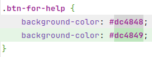

+++
date = '2026-04-10T14:24:03+02:00'
title = "No More Coding Games"
description = "Why I am moving away from ticket factories, algorithmic hiring, and dogmatic processes to focus on what actually matters"
tags = ["manifesto", "career", "pragmatism", "engineering"]
+++

I love solving complex problems. Genuinely. Whether it's architecting a backend capable of handling massive loads, debugging a failed cluster, or dumping a hardware EEPROM to read the firmware. Put me in front of a technical wall, and I'll find a way through, over, or under it.

But over the years, I've developed a severe fatigue for the bureaucracy polluting our industry. What we call "Tech" today too often morphs into an assembly line where micromanagement replaces an engineer's common sense.

Here is why I don't fit into these standard boxes.

### The Algorithmic Recruitment Trap

I am done with Coding Games.

The industry uses a broken model of asking engineers with a decade of production experience to solve timed puzzles on a web platform. These tests don't measure your ability to maintain hybrid infrastructure, fix database / network bottlenecks, or debugging why some tests still fail randomly with a deterministic data seed. They only measure how well you can memorize school algorithms that no one uses in reality.

Let's be honest: the community has already built the most efficient common algorithms. I am not here to solve **$P \stackrel{?}{=} NP$**. I am here to build systems that work. If your hiring process is based on timed puzzles, your engineering culture is likely just as disconnected from reality.

### "Homework" is Still Work

I also refuse "take-home" assignments that require hours of unpaid labor before even meeting the team. At the end of the day, nobody should work for free.

Why not just ask technical questions in person? A real technical exchange is the best way to evaluate a candidate. No internet, no AI help in disguise, just a direct conversation between engineers to see how they think and solve problems. I always recruited like that, and it was always felt right on both sides.

### The Consulting Model

I have nothing against consulting. Helping companies solve technical gaps is a solid job. But I am tired of the "But, we are a family..." corporate speech.

Behind the marketing, you are often just a number on a spreadsheet. I've seen the system from the inside, being sold as an expert to the client while the agency takes a massive cut and refuses to align your salary with the value you produce even with proof and recommendations. I prefer technical recognition over corporate branding and goodies (but I do like goodies tho).

### Agile and R&D: Common Sense First

Methodologies are tools, not religions. You can do great R&D in an Agile environment, but only if you stay pragmatic.

The problem starts when Agile turns into a ticket factory. Negotiating complexity points for every minor task is a waste of time. And also thinking of story points like the number of days leaves me speechless!

> **PM:** "2 story points for changing the color of a button?!"  
> **Dev:** "Yes! I need to talk with the Design team and have a meeting with the UX team to verify usability." 
> **PM:** "That will be quick, right? We already have the hex color code!"  
> **Dev:** "No, it needs some time, so please vote 2 points."  
> **Everyone:** "OK."  
> *The commit 2 days later: 1 line of CSS.*

When a sprint is strictly two weeks long, the pressure often leads to cutting corners. We close the ticket at all costs before the review, even if it means generating technical debt. A few years later, developers are hired to do pure legacy maintenance on the code of a decision-maker who made a bad architectural choice 10 years ago just to save three days on their sprint. We no longer take the time to do things _right_.

### Engineering Standards and Craftsmanship

I am a builder and a problem solver. I build things from scratch: on all levels of the OSI model, from physical network infrastructure to server orchestration, including the backend, internal tools, and e-commerce. I operate as a _System**s** Engineer_ in the broadest sense; I build and bridge the gap between hardware, infrastructure, and software.

I thrive in environments that prioritize engineering quality, pragmatism (no, you probably still don't need Kubernetes), and the _freedom to experiment_ to find the truly right solution.

I don't play your games because I'm too busy building things that actually work and bring me **joy**.
